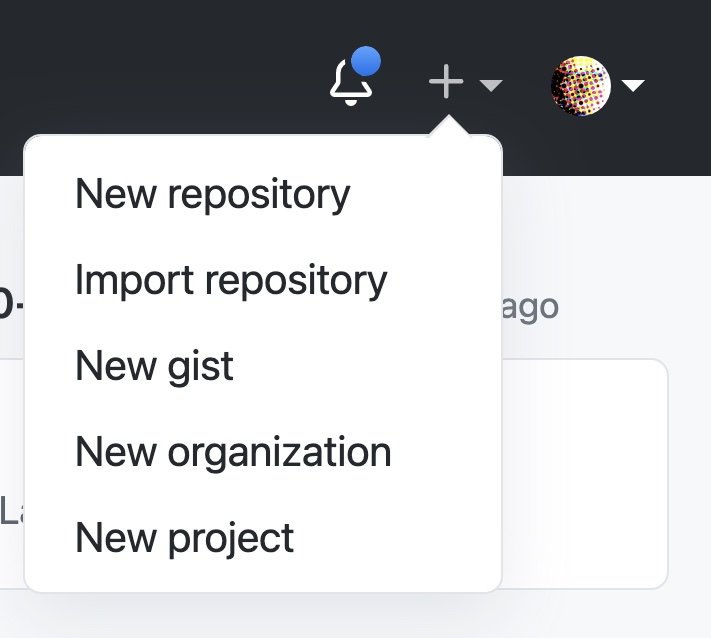
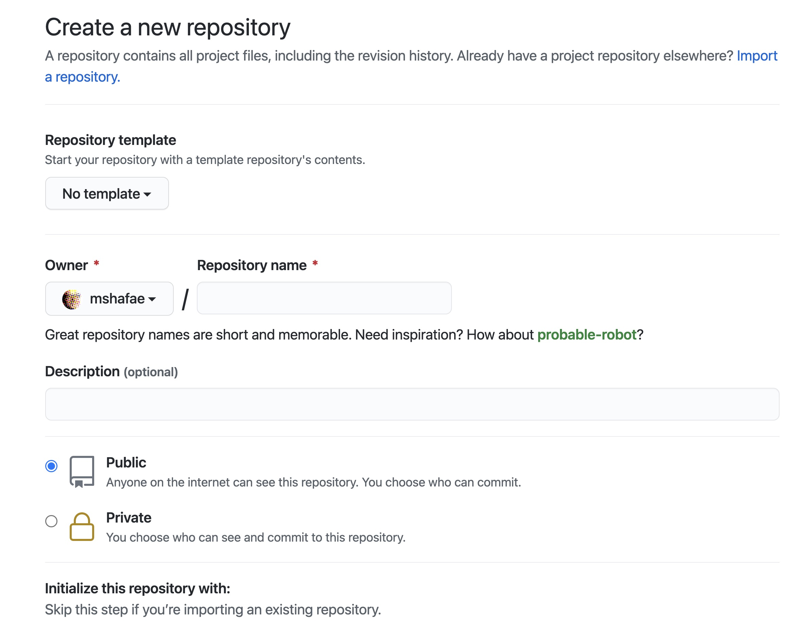
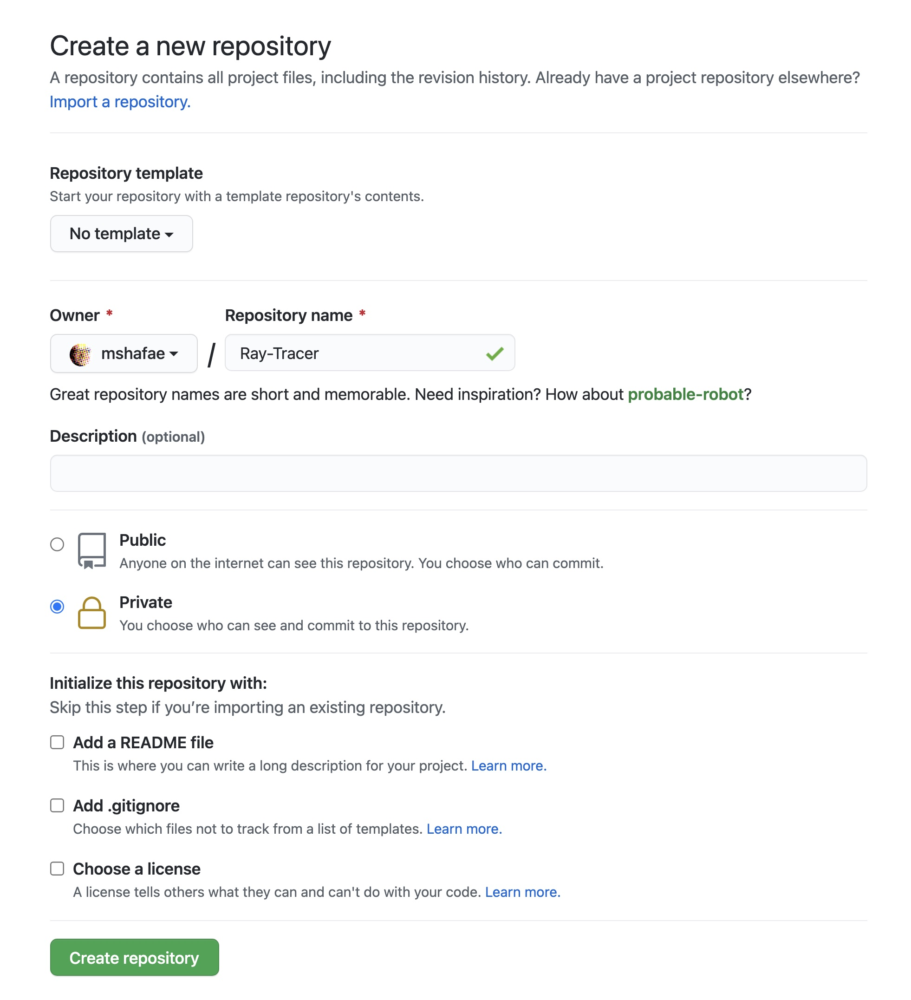
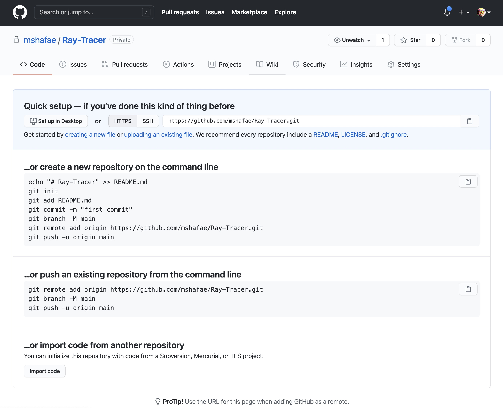

# Transferring Repositories

The repositories that you have created this semester are in your instructor's GitHub account. The repositories will be available to you for at least one semester beyond the end of the current term. That means that if you are taking this course in Fall, you have until the Summer to copy your work out. If you are taking this course in the Spring, you have until Winter to copy your work out.

If you have clone your work onto your computer, you have a copy. However the remote repository that it is connected to is not owned by you. If you wish to continue working on your ray tracer or wish to create a portfolio of the work you've completed this term, then you are urged to make your own remote repositories for your work.

You can do this with any git repository hosting service such as [GitHub](https://github.com/), [BitBucket](https://bitbucket.org/), [GitLab](https://about.gitlab.com/), [Sourceforge](https://sourceforge.net/), [Launchpad](https://code.launchpad.net/), etc.

In this exercise, the assumption is that you are using GitHub, however the instructions can easily be adapted to any hosting service. If you need help, ask your instructor or ILA for assistance.

## Selecting the Target Repository

Let's use the lab from last week as our target repository. Let's assume that your GitHub username is `mshafae` and that the lab we're working with is `cpsc-120-lab-12-mshafae`. This means our goal is to copy `cpsc-120-lab-12-mshafae` into a repository on `mshafae`'s account.

## Create a New Remote Repository

Visit https://github.com/ and sign in.

Once you are signed in, look in the upper right corner of the window. There is a plus sign.


Click the plus sign and select 'New repository'.



Next your prompted with a form. Identify the box for the Repository Name, the radio buttons for the public or private status.



Complete the form by filling in a unique name for your repository. In this example, the name is 'Ray-Tracer'. Set the status of your repository to private. If you can't, then leave it as public. Be aware that anyone can look at your code if you leave it as public.



If you'd like to have private GitHub repositories then consider signing up for [GitHub's Student Developer Pack](https://education.github.com/pack).

Once the form is completed and you have clicked the create button, then your repository is ready to go. You'll see a screen similar to the one shown below.
Don't close this window, we'll need to refer back to the information on this page in the next step.



## Changing Your Local Repository's Origin

If you haven't done so already, make sure you have cloned a copy of your target repository. In this example, we're using `cpsc-120-lab-12-mshafae` which means I have `git clone` the repository to my computer.

Navigate to your repository and use the `git remote -v` command to list out the repository's remote URLs. Make sure your repository is up to date and on the main branch.

```
$ pwd
/Users/mshafae/cpsc120/cpsc-120-lab-12-mshafae
$ git status
On branch main
Your branch is up to date with 'origin/main'.

nothing to commit, working tree clean
$ git remote -v
origin	https://github.com/mshafae-spring-2021/cpsc-120-lab-12-mshafae.git (fetch)
origin	https://github.com/mshafae-spring-2021/cpsc-120-lab-12-mshafae.git (push)
$ 
```

The next step is to identify the new remote URL. Look back on the repository page you just created.


Do you see the line that says `git remote add origin https://github.com/mshafae/Ray-Tracer.git`? We will modify this command a little bit. From the command line, let's add a new remote. Pay close attention to the name of this remote. We will call the new remote URL `nu-origin`.

```
$ git remote add nu-origin https://github.com/mshafae/Ray-Tracer.git
```

Double check your work with the `git remote -v` command. You should see `nu-origin` in the list.
```
$ git remote -v
nu-origin	https://github.com/mshafae/Ray-Tracer.git (fetch)
nu-origin	https://github.com/mshafae/Ray-Tracer.git (push)
origin	https://github.com/mshafae-spring-2021/cpsc-120-lab-12-mshafae.git (fetch)
origin	https://github.com/mshafae-spring-2021/cpsc-120-lab-12-mshafae.git (push)
```

## Pushing Your Work To Nu-Origin

Once you have added an additional remote URL that we named `nu-origin`, we're ready to push all our changes to the new repository. Use the push command to make this happen.

```
$ git push -u nu-origin --all
Enumerating objects: 60, done.
Counting objects: 100% (60/60), done.
Delta compression using up to 4 threads
Compressing objects: 100% (54/54), done.
Writing objects: 100% (60/60), 1.62 MiB | 3.83 MiB/s, done.
Total 60 (delta 2), reused 60 (delta 2), pack-reused 0
remote: Resolving deltas: 100% (2/2), done.
To github.com:mshafae/Ray-Tracer.git
 * [new branch]      main -> main
Branch 'main' set up to track remote branch 'main' from 'nu-origin'.
```

Your output may look a little different, but you can verify that everything worked by visiting your new repository's web page on GitHub and refreshing the page. If everything worked, then you will see your code online.

## Cleaning Up

To ensure future pushes go to the right place, let's clean up the remote URLS.

Use the `git remote -v` command to view a list of the remote URLS.

```
$ git remote -v
nu-origin	https://github.com/mshafae/Ray-Tracer.git (fetch)
nu-origin	https://github.com/mshafae/Ray-Tracer.git (push)
origin	https://github.com/mshafae-spring-2021/cpsc-120-lab-12-mshafae.git (fetch)
origin	https://github.com/mshafae-spring-2021/cpsc-120-lab-12-mshafae.git (push)
```

Our next step is to remove `origin` and rename `nu-origin` to `origin`. We can do this using the following commands.

```
$ git remote rm origin
$ git remote rename nu-origin origin
$ git remote -v
origin	https://github.com/mshafae/Ray-Tracer.git (fetch)
origin	https://github.com/mshafae/Ray-Tracer.git (push)
```

Notice that the URL for `origin` points to the new repository we created.

## Conclusion

Save your programs and be proud of what you have accomplished. Take a look back every now and again to remind yourself of how much you have learned and how you have progressed.

Perhaps you want to create a web page for yourself to show off all the cool stuff you've made. If you are keeping your repositories on GitHub, you can easily create beautiful pages using [GitHub Pages](https://pages.github.com/).